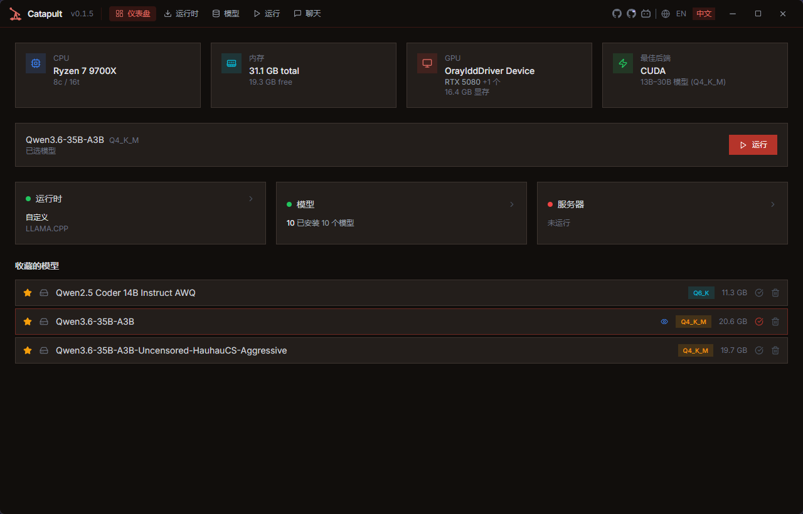
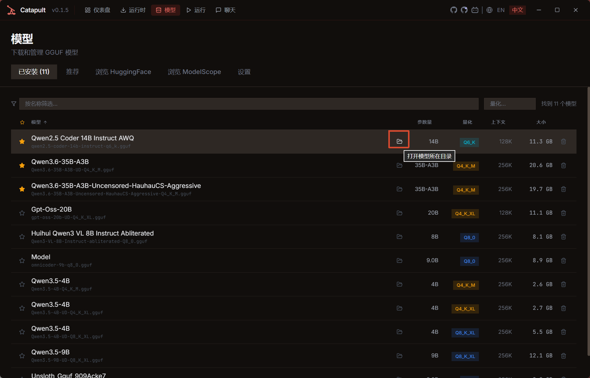
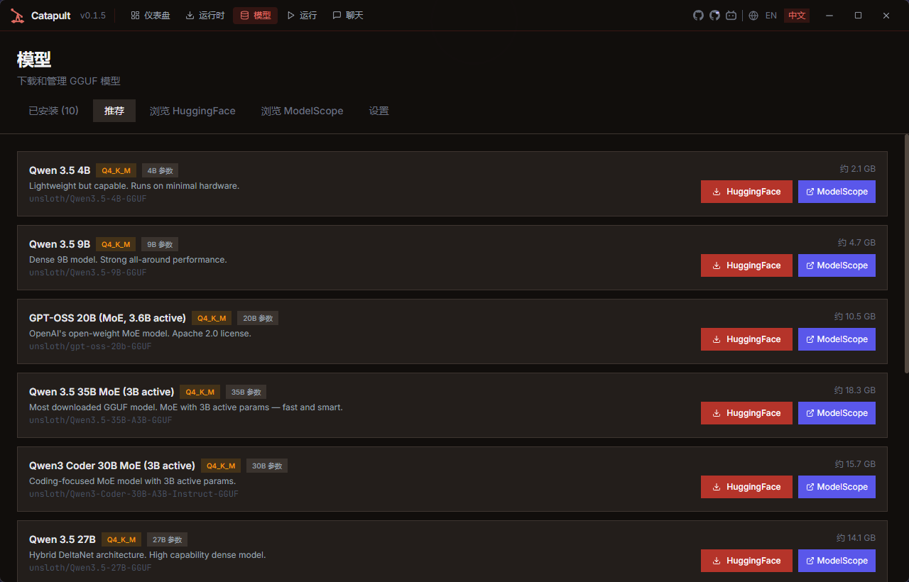
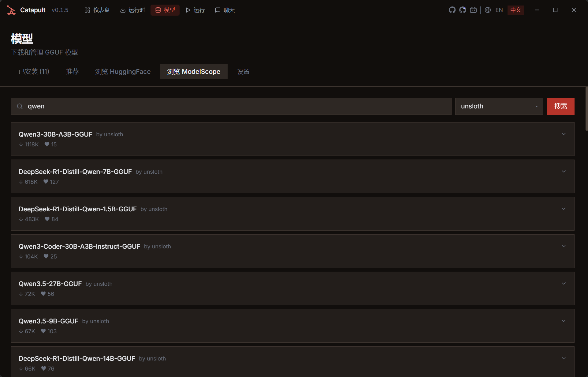
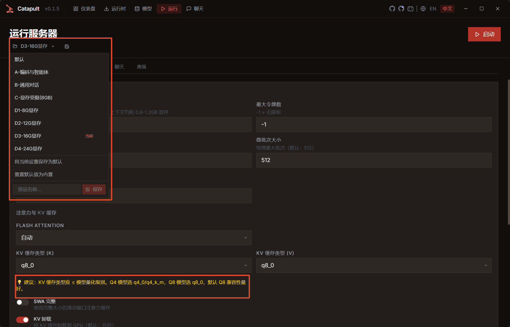

# Catapult-CN


[llama.cpp](https://github.com/ggml-org/llama.cpp) 的桌面启动器。管理运行时版本、发现和下载模型、配置服务器（覆盖所有参数）、提供嵌入式聊天界面——全程无需触碰命令行。

本项目是基于 [pwilkin/catapult](https://github.com/pwilkin/catapult) 的中文汉化分支，增加了 ModelScope 支持、内置推荐配置预设等特性。暂只支持 Windows 平台，TUI 界面未汉化。

所有参数见：[Catapult 完整参数配置指南](docs/Catapult完整参数配置指南.md)

## 汉化版差异

- **中文语言支持**：增加了中文翻译，自适应系统语言，也可手动切换语言
  
- **【模型】-【已安装】面板增强**：
  - 增加了打开模型所在目录按钮，一键直达模型所在目录
    
- **【模型】-【推荐】面板增强**：
  - 点击模型名称，跳转到 ModelScope 对应模型页面
  - 增加 ModelScope 下载按钮
    
- 增加\*\*【浏览 ModelScope】面板\*\*：
  - 可从 ModelScope 上搜索模型，无需魔法直接下载
  - 点击搜索结果中模型名称，可跳转到模型页面，可用作模型管理
    
- **【运行】面板预设增强**：
  - 增加了七套预设，根据自身硬件点击可切换
- **界面信息增强**：
  - 软件界面增加了原版 GitHub 和汉化版本 GitHub 地址，方便查看
    

## 部署示例

> 以 **RTX 5080 16GB** + **Qwen3.6-35B-A3B（Q4_K_M 量化）** 为例

### 硬件配置

| 项目     | 配置                                             |
| -------- | ------------------------------------------------ |
| 显卡     | RTX 5080 16GB GDDR7                              |
| 系统内存 | 32GB+                                            |
| 模型     | Qwen3.6-35B-A3B-Uncensored（Q4_K_M，约 20-22GB） |

### 推荐预设

使用 **D1-16G显存** 预设（点击切换），自动应用以下优化配置：

| 参数            | 值         | 说明                    |
| --------------- | ---------- | ----------------------- |
| GPU 层数        | -1（全部） | 配合 Fit 自动管理       |
| 上下文大小      | 32768      | 约 24000 汉字           |
| Flash Attention | 开启       | 加速 + 省显存           |
| KV 缓存类型     | q8_0       | 兼顾质量与显存          |
| Fit（适配）     | 开启       | 自动卸载溢出层到内存    |
| CPU MoE         | 关闭       | 16GB 不需要强制卸载     |
| mlock           | 开启       | 32GB 内存充足，稳定延迟 |
| 温度            | 0.60       | Qwen 官方推荐           |
| Top-P           | 0.95       | 官方推荐                |
| Top-K           | 40         | 平衡选择                |

### 预估性能

- **推理速度**：约 35-45 tokens/s
- **上下文容量**：约 24000 汉字
- **显存占用**：GPU 约 14-15GB（含 KV Cache）

### 一键启动步骤

1. 进入 **【模型】** 标签页，选择 `Qwen3.6-35B-A3B-Uncensored`
2. 进入 **【运行】** 标签页，点击 **D1-16G显存** 预设
3. 点击 **启动服务器**
4. 进入 **【聊天】** 标签页开始对话


## 下载

最新版本（v0.1.5-1）的预构建二进制文件，点击下表文件名即可直接下载；也可前往 [Releases](../../releases) 页面查看所有历史版本与更新说明。

| 文件                                                                                                                                                                  | 说明                |
| --------------------------------------------------------------------------------------------------------------------------------------------------------------------- | ------------------- |
| [`Catapult-CN_0.1.5-1_x64-setup.exe`](https://github.com/ErgeAIA/catapult-cn/releases/download/v0.1.5-1/Catapult-CN_0.1.5-1_x64-setup.exe)                           | NSIS 安装包（推荐） |
| [`Catapult-CN_0.1.5-1_x64_en-US.msi`](https://github.com/ErgeAIA/catapult-cn/releases/download/v0.1.5-1/Catapult-CN_0.1.5-1_x64_en-US.msi)                             | MSI 安装包          |
| [`Catapult-CN-v0.1.5-1-portable.zip`](https://github.com/ErgeAIA/catapult-cn/releases/download/v0.1.5-1/Catapult-CN-v0.1.5-1-portable.zip)                             | 便携版（解压即用）  |

***

以下内容为英文版 0.1.5 版 README.md 翻译

提供两种界面：

- <br />

## 功能特性

**双界面支持**

- **GUI**：完整的桌面体验，可视化仪表盘、标签页配置、内置 WebUI
- **TUI**：快速键盘驱动的终端界面，包含相同的核心功能（首次启动无需向导）

**运行时管理**

- 从 GitHub Releases 下载托管的 llama.cpp 构建版本，支持自动平台/后端检测
- 多版本共存，随时切换
- 支持指向本地已有的 llama.cpp 安装目录（自定义运行时）
- 后端评分：自动根据硬件推荐 CUDA、Metal、ROCm、Vulkan 或 CPU 版本

**模型管理**

- 扫描多个本地目录，递归发现 GGUF 模型
- 直接从文件头解析 GGUF 元数据（名称、参数量、上下文长度、视觉能力）
- 支持从 HuggingFace 下载模型（断点续传 + 指数退避重试）
- 从 ModelScope 下载模型（国内用户友好）
- 根据硬件筛选的推荐模型列表
- 收藏、排序、筛选、量化级别颜色标识
- 视觉模型检测 + 自动 mmproj 文件配对；仪表盘中标记视觉模型（GUI 显示眼睛图标，TUI 显示 `V` 标记）

**服务器配置**

- 完整覆盖 llama.cpp 服务器参数——GUI 使用标签页（Context、Hardware、Sampling、Server、Chat、Advanced），TUI 使用自动补全驱动的参数编辑器
- 保存和加载命名配置预设；每个模型记住预设（选择模型时自动加载上次使用的预设）
- 从 HuggingFace 下载模型时自动导入 `presets.ini`（采样参数作为命名预设应用）
- 进程生命周期管理 + 日志流
- 仪表盘一键启动

**聊天**

- 通过 iframe 在应用内嵌入 llama.cpp WebUI（GUI）或通过 llama-cli（TUI）
- 弹出到独立窗口（GUI）

**首次启动向导（GUI）**

- 硬件检测 + 运行时推荐
- 模型选择（带硬件适配提示）
- 一分钟内从零到聊天

## 下载

预构建的二进制文件（Linux、macOS 通用版、Windows）可在 [Releases](../../releases) 页面下载。

| 平台    | 格式                                  |
| ------- | ------------------------------------- |
| Linux   | AppImage、.deb                        |
| macOS   | .dmg（通用版：Intel + Apple Silicon） |
| Windows | .msi                                  |

## 从源码构建

### 前置要求

- [Node.js](https://nodejs.org/) 18+
- [Rust](https://www.rust-lang.org/tools/install)（stable 版本）
- 平台相关依赖（见下方）

#### Linux

```bash
sudo apt-get install libwebkit2gtk-4.1-dev libgtk-3-dev libappindicator3-dev librsvg2-dev patchelf
```

#### macOS / Windows

无需额外系统依赖。

### 构建

```bash
# 安装前端依赖
npm install

# 开发模式（打开 Tauri 窗口，支持热重载）
npm run dev

# 生产构建（输出到 src-tauri/target/release/bundle/）
npm run build

# 运行 TUI（终端界面）
npm run tui
# 或直接用 cargo：
cargo run --manifest-path src-tauri/Cargo.toml --bin catapult-tui
```

## TUI 使用

TUI 以键盘驱动的终端界面提供与 GUI 相同的核心功能。

### 全局快捷键

| 按键                         | 功能                                                         |
| ---------------------------- | ------------------------------------------------------------ |
| `d`, `r`, `m`, `s`, `l`, `c` | 切换标签页（Dashboard、Runtime、Models、Server、Logs、Chat） |
| `↑/↓`                        | 浏览列表                                                     |
| `Enter`                      | 选择/确认                                                    |
| `Esc`                        | 返回（返回上级或仪表盘）                                     |
| `q`                          | 退出                                                         |
| `Ctrl+C`                     | 立即退出                                                     |
| `Ctrl+X`                     | 中止正在进行的下载                                           |

### 标签页

- **Dashboard** — 系统信息（CPU、RAM、GPU）、运行时和服务器状态、已安装模型列表。`Enter` 选择模型跳转到 Server；`f` 切换收藏；`x` 停止服务器。
- **Runtime** — 列出托管和自定义运行时。`d` 获取最新 llama.cpp 版本并显示资源选择器；`a` 激活选中的运行时。
- **Models** — 四种子模式，用 `b`（浏览 HuggingFace）、`e`（推荐）、`p`（目录）、`Esc`（返回已安装）切换。已安装模式：`/` 筛选，`f` 收藏，`x` 删除，`Enter` 选择模型 → Server 标签页。浏览模式搜索 HuggingFace 并下载 GGUF 文件，视觉模型会显示 mmproj 选择器。
- **Server** — 自动补全驱动的参数编辑器，支持 `50+` llama-server 参数。`/` 或 `Tab` 搜索参数，`Enter` 启动服务器，`x` 停止。`l` 加载预设，`s` 保存预设。`Delete`/`Backspace` 移除覆盖。
- **Logs** — 实时服务器日志查看器。`f` 切换自动跟随，`PageUp`/`PageDown`/`Home`/`End` 滚动。
- **Chat** — 启动 `llama-cli` 作为子进程，使用选中的模型和服务器设置。`Tab` 聚焦额外参数字段，`Enter` 启动。llama-cli 退出后（`Ctrl+C` 或 `/exit`）TUI 自动恢复。

### 构建 TUI

```bash
# 直接运行
cargo run --manifest-path src-tauri/Cargo.toml --bin catapult-tui

# 构建发布版二进制
cargo build --manifest-path src-tauri/Cargo.toml --bin catapult-tui --release
# 二进制文件位于：src-tauri/target/release/catapult-tui
```

## 测试

```bash
# 前端测试（Vitest）
npm test

# Rust 测试
cargo test --manifest-path src-tauri/Cargo.toml

# 前端类型检查
npx tsc --noEmit
```

## 更新日志

详细更新内容请查看 [CHANGELOG.md](CHANGELOG.md)。

## 架构

详细技术文档（IPC 模式、数据目录、运行时/模型/服务器子系统等）请查看 [ARCHITECTURE.md](ARCHITECTURE.md)。

## 技术栈

- **后端：** Rust、Tauri v2、Tokio、Reqwest、Serde
- **前端（GUI）：** React、TypeScript、Vite、Tailwind CSS
- **前端（TUI）：** [ratatui](https://github.com/ratatui/ratatui)、crossterm、tui-input
- **测试：** Vitest（前端）、`#[cfg(test)]` 模块（后端）
- **CI：** GitHub Actions — 每次 push/PR 运行测试，main/tags 分支触发跨平台构建

## 作者信息

<table>
<tr>
<td align="center" width="200">
<br>
<b>宝藏二哥AIA / ErgeAIA</b><br>
<sub>生命不息，折腾不止</sub>
</td>
<td>

**关于我**：独立开发者 / 全栈工程师 / ComfyUI 爱好者 / Vibe Coding 实践者

**技术栈**：Tauri · Rust · React · Python · Claude · ZCode · Workbuddy

**理念**：三无分享 — 无门槛、无套路、无保留

**链接**：
- 📺 [B 站](https://space.bilibili.com/67221461) · [知乎](https://www.zhihu.com/people/meli55a/posts) · 微信公众号(ErgeAIA)
- 🐙 [GitHub](https://github.com/ErgeAIA) · [Gitee](https://gitee.com/ErgeAIA)
- 📦 精选项目：[ErgeMD](https://github.com/ErgeAIA/ErgeMD) · [ErgeHash](https://github.com/ErgeAIA/ErgeHash) · [catapult-cn](https://github.com/ErgeAIA/catapult-cn)

</td>
</tr>
</table>

---

<div align="center">

如果 catapult-cn 帮到了你，欢迎点个 Star 鼓励一下！

</div>

## 许可证

基于 [Apache License, Version 2.0](LICENSE) 许可证。

原始项目 [pwilkin/catapult](https://github.com/pwilkin/catapult) 版权所有 2026 Piotr Wilkin。


